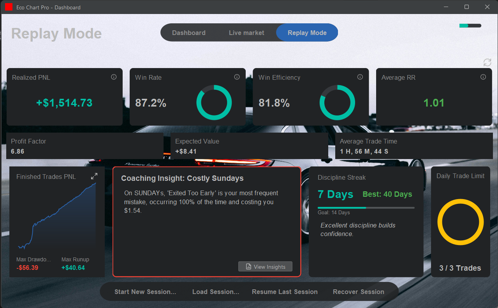
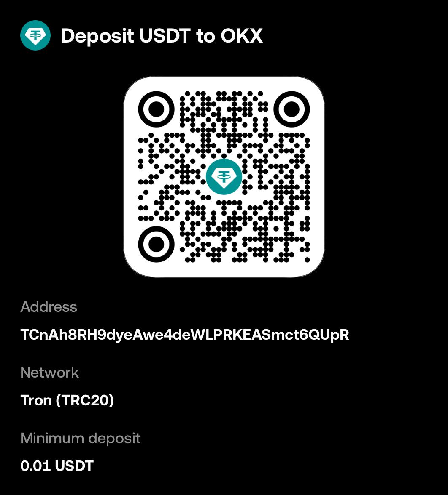

Eco Chart Pro
Eco Chart Pro is a comprehensive desktop platform designed for traders to master their strategy and psychology. It's not just another charting tool; it's a dedicated training environment built on a powerful feedback loop: Backtest → Journal → Analyze → Improve.

The Core Feedback Loop
Eco Chart Pro is built around four key pillars that work together to help you become a more disciplined and profitable trader.
🔎 Backtest with Precision (Replay Mode)
Step through historical market data bar-by-bar in a high-fidelity simulated environment. Test your strategies against real market conditions without risking capital. The replay engine is the foundation of your practice.
✍️ Journal Every Decision
Go beyond simple P&L. For every trade, the guided journaling system prompts you to log your emotional state, plan adherence, setup quality, and any mistakes made. This creates a rich dataset of your trading behavior.
💡 Gain Actionable Insights
Turn your raw journal data into wisdom. The Coaching Service automatically analyzes your trading patterns to find recurring issues, time-based weaknesses, and hidden strengths. It's like having a personal trading coach reviewing your performance.
🏆 Level Up Your Discipline (Gamification)
Stay motivated and build consistent habits with an integrated progression system. Earn Experience Points (XP) for disciplined trading, unlock achievements for reaching key milestones, and take on daily challenges to improve specific skills.
For Power Users & Developers
🔧 Build Your Own Edge (Custom Indicators)
Go beyond built-in indicators. Eco Chart Pro features a complete in-app Java editor with code completion and an extensive API. Write, compile, and hot-reload your own custom indicators directly onto your charts without ever leaving the application.
🗺️ Project Roadmap
This project is under active development. The roadmap is divided into several key phases focused on architectural improvements, feature expansion, and usability enhancements.
Phase 1: Core Architecture & UI Refinement
[In Progress] Polymorphic Drawing Tool Settings: Refactor the drawing tool settings logic to use a polymorphic approach, allowing each drawing tool to manage its own settings dialog for better extensibility.
[Planned] Info Cursor Tool: Introduce a new cursor mode that displays a detailed information panel about the candle and indicator values under the cursor.
[Planned] Right-Click Context Menus: Provide faster access to common actions (e.g., delete drawing, modify order) via context-sensitive right-click menus on the chart.
[Planned] Enhanced Chart Interaction: Implement zoom-to-cursor and click-and-drag axis scaling for a more fluid and intuitive chart navigation experience.
Phase 2: Advanced Analysis & Trading Features
[Planned] P&L Calculation Service: Refactor all unrealized P&L calculations into a dedicated, centralized service to ensure consistency and eliminate logic duplication.
[Planned] Drawing Tool Templates: Implement a system for users to create, save, and apply multiple named style templates for each drawing tool.
Phase 3: Live Data & Trading
[Planned] Multi-Source Data Integration: Expand data handling to support multiple live and historical data providers (e.g., Binance, OKX, Yahoo Finance), allowing users to select their preferred source.
[Planned] Live Data Integration: Connect the charting engine to live WebSocket data feeds for real-time market data.
[Planned] Live Trading Integration: Implement a TradingService for live brokerage APIs to enable real-money trading directly from the platform.
Phase 4: Usability & Polish
[Planned] Onboarding & Help System: Add a "Help" menu and an "About" dialog with application information and links to documentation.
Technology Stack
Language: Java 21
UI Framework: Java Swing
Look and Feel: FlatLaf
Build System: Gradle
Core Libraries:
SLF4J & Logback: For robust logging.
Jackson: For high-performance JSON serialization (session saving/loading).
SQLite-JDBC: For local database storage of market data.
ClassGraph: For fast, reliable plugin and classpath scanning.
RSyntaxTextArea: For the feature-rich in-app Java code editor.
Getting Started
Prerequisites
Java Development Kit (JDK) 21 or later.
Git for cloning the repository.
How to Run
Clone the repository to your local machine:
code
Bash
git clone https://github.com/rphlmrk/EcoChartPro.git
cd EcoChartPro
Build and run the application using the included Gradle wrapper:
code
Bash
# On Windows
./gradlew.bat run

# On macOS / Linux
./gradlew run
Support the Project ❤️
If you find Eco Chart Pro useful or believe in its vision, please consider supporting its continued development. Your support helps cover costs and motivates the implementation of new features on the roadmap.
⭐ Star the Repository: The quickest way to show your support is by starring the project on GitHub!
💸 Make a Donation: If you'd like to contribute financially, you can use any of the methods below.
PayPal
You can send a one-time donation via PayPal.
https://www.paypal.com/paypalme/raphaelochieng
Binance Pay
Scan the QR code below with your Binance App to send a crypto donation.

Crypto (USDT)
You can send USDT to the following address on the Tron (TRC20) network.
Address:
code
Code
TCnAh8RH9dyeAwe4deWLPRKEASmct6QUpR
QR Code:

Author
Raphael Mark
License
This project is licensed under the MIT License - see the LICENSE file for details.