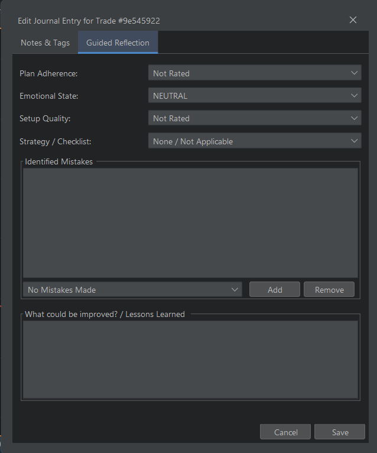

# Eco Chart Pro
A Professional Charting & Backtesting Platform for Deliberate Practice.


**Eco Chart Pro is a comprehensive desktop platform for discretionary traders who want to master their strategy and psychology through deliberate practice.** It is a professional-grade training environment built on a powerful feedback loop: **Backtest → Journal → Analyze → Improve.**


---

## Table of Contents
- [What is Eco Chart Pro?](#what-is-eco-chart-pro)
- [✨ Key Features](#-key-features)
  - [High-Fidelity Replay Mode](#-high-fidelity-replay-mode)
  - [In-Depth Guided Journaling](#-in-depth-guided-journaling)
  - [Automated Analytics & Coaching](#-automated-analytics--coaching)
  - [Gamified Progression System](#-gamified-progression-system)
  - [Custom Indicators & Live Editor](#-custom-indicators--live-editor)
  - [Community Plugin Marketplace](#-community-plugin-marketplace)
  - [Live Data & Paper Trading](#-live-data--paper-trading)
- [For Developers: Build Your Own Edge](#for-developers-build-your-own-edge)
- [🗺️ Project Roadmap](#️-project-roadmap)
- [Technology Stack](#technology-stack)
- [Getting Started](#getting-started)
- [Support the Project ❤️](#support-the-project-️)
- [Author](#author)
- [License](#license)

---

## What is Eco Chart Pro?
Traditional charting platforms are built for executing live trades. **Eco Chart Pro is built for practice.** It's a high-fidelity simulator and an advanced analytics suite rolled into one, designed to help you identify behavioral patterns, refine your edge, and build the discipline required for consistent profitability.

---

## ✨ Key Features
Eco Chart Pro is packed with features designed to create a complete training ecosystem for traders.

### 🔎 High-Fidelity Replay Mode
Step through historical 1-minute market data bar-by-bar. Simulate trade execution (market, limit, stop orders), including stop-loss and take-profit management, and experience realistic market conditions without risking capital.


### ✍️ In-Depth Guided Journaling
Go beyond simple P&L. For every trade, the guided journaling system prompts you to log your emotional state, plan adherence, setup quality, and any mistakes made. This creates a rich dataset of your trading behavior.




### 💡 Automated Analytics & Coaching
Turn your raw journal data into wisdom. The **Coaching Service** automatically analyzes your trading patterns to find recurring issues, time-based weaknesses, and hidden strengths. Generate comprehensive PDF and HTML performance reports with a single click.


### 🏆 Gamified Progression System
Stay motivated and build consistent habits with an integrated progression system. Earn Experience Points (XP) for disciplined trading, unlock achievements for reaching key milestones, and take on daily challenges to improve specific skills.


### 🚀 Custom Indicators & Live Editor
Go beyond built-in indicators. Eco Chart Pro features a complete in-app Java editor with code completion and an extensive API. Write, compile, and hot-reload your own custom indicators directly onto your charts without ever leaving the application.


### 🔌 Community Plugin Marketplace
Expand the platform's capabilities with a single click. The integrated marketplace allows you to browse, install, and manage custom indicators developed by the Eco Chart Pro community.


### 📈 Live Data & Paper Trading
Connect to live WebSocket data feeds from major exchanges (Binance, OKX) for real-time charting. Practice your strategy in a live market environment with the live paper trading mode.


---

## For Developers: Build Your Own Edge
Eco Chart Pro features a powerful Java API that allows you to create your own complex, stateful indicators.
-   **Complete In-App Java Editor:** Write, compile, and hot-reload your code directly onto your charts. Features include syntax highlighting and API code completion.
-   **Stateful Indicator Support:** The API includes lifecycle hooks (`onSettingsChanged`, `onRemoved`) and a persistent `state` map, enabling the correct implementation of stateful indicators like EMAs and custom oscillators.
-   **Multi-Timeframe (MTF) Access:** Indicators can request data from higher timeframes within their calculation logic to analyze market structure.
-   **Share Your Work:** Contribute your indicators to the community by submitting them to the [EcoChartPro Community Marketplace](https://github.com/rphlmrk/EcoChartPro-Community-Marketplace).

---

## 🗺️ Project Roadmap
This project is under active development. The roadmap is divided into key phases focused on architectural improvements, feature expansion, and usability enhancements.

### Phase 1: Live Data & Advanced Features
-   ✅ Live Data Integration (Binance, OKX)
-   ⬜ **Alert System:** Implement a flexible alert system. Users can set price-based alerts, alerts on indicator values (e.g., "RSI crosses 70"), and alerts triggered by drawing objects (e.g., "price crosses this trendline").

---

## Technology Stack
-   **Language:** Java 21
-   **UI Framework:** Java Swing
-   **Look and Feel:** [FlatLaf](https://www.formdev.com/flatlaf/)
-   **Build System:** Gradle
-   **Core Libraries:**
    -   **SLF4J & Logback:** For robust logging.
    -   **Jackson:** For high-performance JSON serialization (session saving/loading).
    -   **SQLite-JDBC:** For local database storage of market data.
    -   **ClassGraph:** For fast, reliable plugin and classpath scanning.
    -   **RSyntaxTextArea:** For the feature-rich in-app Java code editor.

---

## Getting Started

### Prerequisites
-   Java Development Kit (JDK) 21 or later.
-   Git for cloning the repository.

### How to Run
1.  Clone the repository to your local machine:
    ```bash
    git clone https://github.com/rphlmrk/EcoChartPro.git
    cd EcoChartPro
    ```
2.  Build and run the application using the included Gradle wrapper:
    ```bash
    # On Windows
    ./gradlew.bat run

    # On macOS / Linux
    ./gradlew run
    ```

---

## Support the Project ❤️
If you find Eco Chart Pro useful or believe in its vision, please consider supporting its continued development. Your support helps cover costs and motivates the implementation of new features on the roadmap.

-   **⭐ Star the Repository:** The quickest way to show your support is by starring the project on GitHub!
-   **💸 Make a Donation:** If you'd like to contribute financially, you can use any of the methods below.

<details>
  <summary><b>PayPal</b></summary>
  
  You can send a one-time donation via PayPal.

  [https://www.paypal.com/paypalme/raphaelochieng](https://www.paypal.com/paypalme/raphaelochieng)
</details>

<details>
  <summary><b>Binance Pay</b></summary>
  
  Scan the QR code below with your Binance App to send a crypto donation.

  
</details>

<details>
  <summary><b>Crypto (USDT TRC20)</b></summary>
  
  You can send USDT to the following address on the **Tron (TRC20)** network.

  **Address:** `TCnAh8RH9dyeAwe4deWLPRKEASmct6QUpR`

  **QR Code:**
  
</details>

---

## Author
-   **Raphael Mark**

## License
This project is licensed under the **Custom Pay-for-Commercial + Contributor-Friendly License (v1.0)**.  
It is **free for personal, educational, research, and open-source use**, but **commercial use requires a paid license** from the author.

See the [LICENSE](LICENSE) file for the full terms, or contact the author for commercial licensing.

**Copyright © 2025 Raphael Mark Omondi. All rights reserved.**